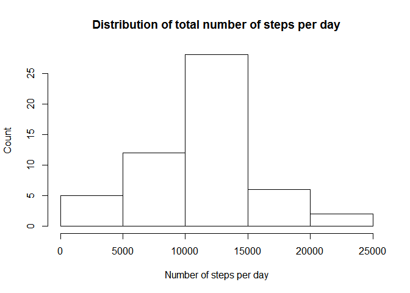
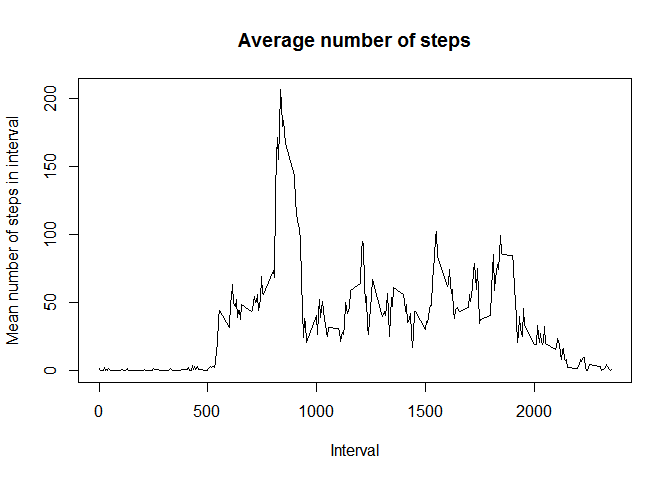
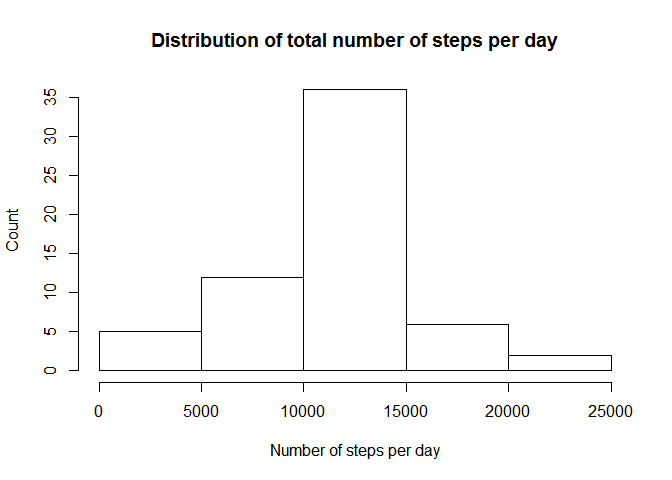

# Reproducible Research: Peer Assessment 1


## Loading and preprocessing the data

Unzip files (had to comment it out because unzipping required write access)

```r
#setwd(dirname(rstudioapi::getActiveDocumentContext()$path))
#unzip("activity.zip")
```

Load .csv file

```r
stepData <- read.csv("activity.csv")

# convert to date
stepData$date <- as.Date(stepData$date, format = "%Y-%m-%d")
```

## What is mean total number of steps taken per day?

use dplyr to group by day and summarize number of steps per day
then plot histogram and report mean and median


```r
library(dplyr)
```

```
## 
## Attaching package: 'dplyr'
```

```
## The following objects are masked from 'package:stats':
## 
##     filter, lag
```

```
## The following objects are masked from 'package:base':
## 
##     intersect, setdiff, setequal, union
```

```r
totalSteps <- stepData %>%
                  group_by(date) %>%
                  summarize(sum = sum(steps))
totalSteps <- totalSteps$sum

hist(totalSteps, xlab = "Number of steps per day", ylab = "Count", main = "Distribution of total number of steps per day")
```

<!-- -->

```r
mean(totalSteps, na.rm = TRUE)
```

```
## [1] 10766.19
```

```r
median(totalSteps, na.rm = TRUE)
```

```
## [1] 10765
```


## What is the average daily activity pattern?

use dplyr to group by time interval and calculate mean across days

```r
meanSteps <- stepData %>%
                  group_by(interval) %>%
                  summarize(m = mean(steps, na.rm = TRUE))

plot(meanSteps$interval, meanSteps$m, type = "l", xlab = "Interval",
     ylab = "Mean number of steps in interval", main = "Average number of steps")
```

<!-- -->
The maximum number of steps occurs in the following interval:

```r
meanSteps[which.max(meanSteps$m),]$interval
```

```
## [1] 835
```


## Imputing missing values

number of missing values in dataset:

```r
sum(is.na(stepData$steps))
```

```
## [1] 2304
```

replace missing values with mean of that 5-minute interval

```r
# get indices of NAs
naIdx <- which(is.na(stepData$steps))

# get indices of replacement values
repIdx <- match(stepData[naIdx,"interval"], meanSteps$interval)

# replace values
stepDataNArm <- stepData
stepDataNArm[naIdx, "steps"] <- meanSteps[repIdx, "m"]
```


use dplyr to group by day and summarize number of steps per day
then plot histogram and report mean and median


```r
totalSteps2 <- stepDataNArm %>%
                  group_by(date) %>%
                  summarize(sum = sum(steps))
totalSteps2 <- totalSteps2$sum

hist(totalSteps2, xlab = "Number of steps per day", ylab = "Count", main = "Distribution of total number of steps per day")
```

<!-- -->

```r
mean(totalSteps2)
```

```
## [1] 10766.19
```

```r
median(totalSteps2)
```

```
## [1] 10766.19
```
Do these values differ from the estimates from the first part of the assignment?

- The mean number of steps per day doesn't change, but the median changes.

What is the impact of imputing missing data on the estimates of the total
daily number of steps?

 - Imputing missing data can change mean and median of the data. In the case where whole days are replaced with the mean of the data (and not just a few sample points), the mean doesn't change.


## Are there differences in activity patterns between weekdays and weekends?

create factor variable for "weekend" and "weekday"


```r
isWeekend <- as.POSIXlt(stepDataNArm$date)$wday == 6 |
             as.POSIXlt(stepDataNArm$date)$wday == 0

stepDataNArm$weekday <- "weekday"
stepDataNArm$weekday[which(isWeekend)] <- "weekend"
stepDataNArm$weekday <- as.factor(stepDataNArm$weekday)
```

plot average steps as function of interval for weekdays and weekends


```r
library(lattice)
library(tidyr)
```

```
## Warning: package 'tidyr' was built under R version 3.3.2
```

```r
# generate temporary intervalDay variable for grouping
meanStepsWeekday <- stepDataNArm %>%
                  unite(intervalDay, interval, weekday, sep = "_") %>%
                  group_by(intervalDay) %>%
                  summarize(m = mean(steps, na.rm = TRUE)) %>%
                  separate(intervalDay, c("interval", "weekday"),
                           sep = "_", convert = TRUE) %>%
                  arrange(interval) %>%
                  xyplot(x = m ~ interval | weekday, type = "l", layout = c(1,2),
                         xlab = "Interval", ylab = "Number of steps") %>%
                  print
```

<!-- -->


